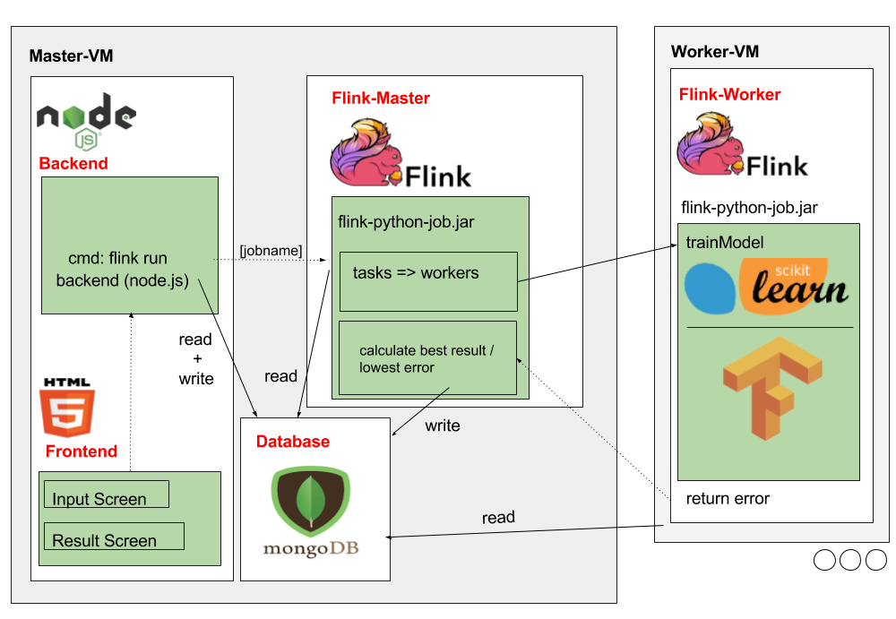
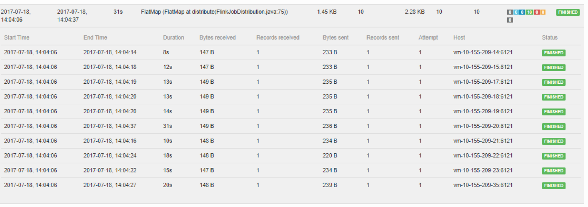

# Flink Cluster Model Trainer

This is a project done in the summer term 2017 for my practical course on "Big Data Science".

## Introduction

Full-stack application that lets users select Machine Learning models (Linear Regression, SVM, Neural Networks) and train them on a Flink cluster. Models are distributed on cluster for training.

The idea of this project to parallelize hyperparameter tuning for ML algorithms.

## User story
- User uploads CSV for training and testing in the GUI to server
- Selects algorithms and hyperparameters to execute
- The files get send to a Node.js backend that creates a JSON file that contains job info including hyperparameters and CSV files
- The JSON is stored in a MongoDB database
- Java file on Master node reads the JSON file from the MongoDB and sends Flink jobs to nodes in the cluster
- Cluster nodes execute scikit-learn/Tensorflow jobs and send back results to Master node
- User sees results of ML algorithms in the AJAX frontend

## Architecture

Note that the reason we used an additional layer of Java was not intended in the beginning of the project. We planned to use the Python binding of Flink but it turned out to not work as well as the Java version. We thus had to fall back to a kind of complex stack involving a lot of different technologies.

## Built with
- HTML5
- JavaScript (Node.js)
- Java (Apache Flink)
- MongoDB
- Python (scikit-learn, Tensorflow)

## Scalability
The program scales to an arbitrary number of nodes. Here we show running 10 ML algorithm jobs on 10 nodes in the cluster.

## Interesting files

- [ML algorithms for Flink nodes](python/traffic-prediction/src/flink) 
- [Testing algorithms on example dataset from KDD Cup 2017](python/traffic-prediction/src/models)
